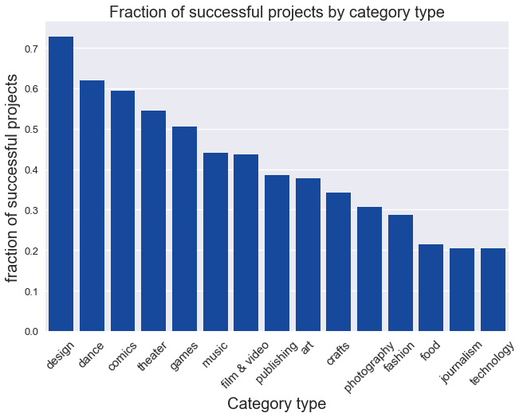
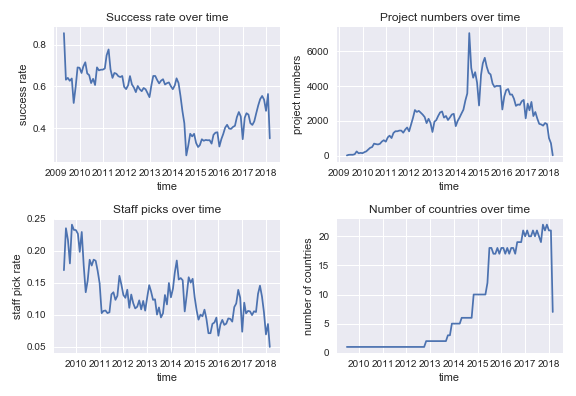

# Success Indicators of Crowdfunding Projects - final report

### _Lukas Vlcek_

---

## Table of Contents

* [1. Introduction](#1.-introduction)

* [2. Dataset](#2.-dataset)

    * [2.1 Source and format](#2.1-Source-and-format)
    * [2.2 Contents of raw data](#2.2-Contents-of-raw-data)
    * [2.3 Limitations](#2.3-Limitations)
* [3. Data wrangling](#3.-Data-wrangling)
    * [3.1 Dataset contents and relevant features](#3.1-Dataset-contents-and-relevant-features)
    * [3.2 Merging data from multiple CSV files](#3.2-Merging-data-from-multiple-CSV-files)
    * [3.3 Filtering and cleaning data](#3.3-Filtering-and-cleaning-data)
* [4. Exploratory analysis](#4.-Exploratory-analysis)
    * [4.1 Project categories](#4.1-Project-categories)
    * [4.2 Goal amounts](#4.2-Goal-amounts)
    * [4.3 Country of origin](#4.3-Country-of-origin)
* [5. Statistical analysis](#5.-Statistical-analysis)
    * [5.1 Predictor and target variables](#5.1-Predictor-and-target-variables)
    * [5.2 Data variation over time](#5.2-Data-variation-over-time)
    * [5.3 Significance of predictor variables](#5.3-Significance-of-predictor-variables)
    * [5.4 Correlations between predictor variables](#5.4-Correlations-between-predictor-variables)
* [6. Predictive modeling](#6.-Predictive-modeling)
    * [6.1 Approach](#6.1-Approach)
    * [6.2 Data preparation](#6.2-Data-preparation)
    * [6.3 Modeling pipeline](#6.3-Modeling-pipeline)
    * [6.4 Hyperparameter grid search](#6.4-Hyperparameter-grid-search)
    * [6.5 Model evaluation](#6.5-Model-evaluation)
    * [6.5 Feature significance](#6.5-Model-evaluation)
* [7. Conclusions](#7.-Conclusions)

## 1. Introduction

Online crowdfunding platforms have become popular places for individuals and small teams to raise money for their projects by aggregating funds from many small investors. One of the earliest and most dominant platforms has been Kickstarter, which has attracted more than 200,000 project proposals, out of which more than 100,000 have been successfully funded. It offers 15 main categories with a large number of subcategories, which are mainly focused on arts and manufacturing novel gadgets. The projects are only funded if the full amount is raised (all or nothing system), and the recent overall success rate is around 36%. The main goal of the project proposers is therefore to gather enough funding sufficient for completing their project by choosing the right category, funding target, and appropriate project description and promotion.

To decide whether it is worth starting a funding campaign or investing money in manufacturing of a new product, it is important to evaluate the expected success or failure of the project and to optimize the chances of success by choosing appropriate project category, funding target, and description. The goal of this data science project is to provide a tool for a client to make informed decisions about how (and whether) to proceed with their funding campaign.

This will accomplished by analysing historical data from the Kickstarter database of past and current projects to find indicators of success. With a predictive model, a client could weight the cost of their initial investments, and adjust the variables under their control to optimize the proposal to increase the chances of funding through adjustments to target amounts, the use of certain keywords, or the effect of more thorough and professional presentation. In addition, a predictive model of proposal success may serve as a filter for investors making decisions about funding. Also, individuals looking for new ideas could use the results to identify promising areas and avoid those with lower chance of success.

In the following I will analyze trends and correlations in the data to identify predictive features and construct a predictive model of succesful funding. Understandably, the model cannot be exptected to be completely accurate, because evaluation of the intrinsic value of a unique novel product often requires a substantial domain knowledge, which may be impossible to glean only from quantitative characteristics of the past records. However understanding the general drivers of proposal success may put the expectation of potential startups in perspective and avoid unnecessary costs.

## 2. Dataset

### 2.1 Source and format
The primary source of data for the Kickstarter platform has been obtained from online, monthly updated repositories collected by a web scraping company [Web Robots](https://webrobots.io/).

* [Kickstarter data (4/2014 - present): https://webrobots.io/kickstarter-datasets/](https://webrobots.io/kickstarter-datasets/). 

The data sets are available in JSON and CSV formats. For the present analysis, I chose CSV files, which are grouped into montly archives, with each archive containing around 30 individual files.

### 2.2 Contents of raw data

The total number of records in the combined CSV files was nearly 4 million, however most of these records were duplicates of the same projects recorded each month. Inspection of the individual CSV files indicated that monthly records starting from March 2016 to present adhere to the same features. These were selected for further analysis, while the older were discarded. Given the vast majority of the data adhered to the newer format and with reported >200K unique projects/samples the retained records should contain enough data for statistical analysis and modeling. This selection also eliminated missing values in the dataset.
Each of the selected records is characterized by 32 features, including dates, deadlines, project descriptions, funding goals, and invested funds.

### 2.3 Limitations

There are potentially additional sources of valuable data available on the internet, in the form of favorable articles, independent reviews, or responses under related video presentation (e.g., YouTube). Including this information would be valuable for increasing the accuracy of the predictive model, however, this would be beyond the scope of the currently proposed work.

## 3. Data wrangling

### 3.1 Dataset contents and relevant features

Inspection of the columns indicate that many entries are in the form of JSON strings, with useful information embedded inside the directory structure. Some columns do not seem to contain information useful for this project (e.g. photo), and dates are stored in the form of a datastamp. Only informative relevant columns were selected, reducing their overall number from 32 to 18.

### 3.2 Merging data from multiple CSV files

All 961 CSV files were read from the raw data directory tree and stored in a new concatenated dataframe.
The resulting dataset shows significant duplication of records as the same projects are recorded month after month. In fact around 90% of the entries are duplicates. While I have dropped identical records, there are still duplicate projects with the same id. As I am interested in comparing different projects and their final status, I eliminated all ID duplicates to only keep the last one. Roughly 260K unique project records remained in the dataset, which corresponds to the number reported by Kicstarter.

### 3.3 Filtering and cleaning data

As inspection of the entries revealed, several were in the JSON string format. I have extracted the imporant 'category' feature from the appropriate JSON string in the 'category' column using 'map' method and JSON module. The resulting dataframe was saved in the interim data directory. Since the 'category' feature is rather fine grained with 169 different labels, I have processed this column to extract the more general category type descriptor which was contained as the first part of the category string (before '/'). The new cat_type colomn with 15 unique labels was added for exploratory analysis. The check for erroneous outliers did not reveal any suspicious items, only very skewed distributions. The resulting dataframe was saved in data/processed directory. The original 43 GB of raw data was reduced to a ~90 MB CSV file.

## 4. Exploratory analysis 

### 4.1 Project categories

Each project falls into one of 15 major categories, with most frequent being 'technology' and the least frequent 'dance'.

It turns out that there are large variations between success rates of different categories, with design and dance most easily achieving their funding goals, while technolgy being the least successful in this respect.

However, the total amounts invested in different categories reflect not just their success rate, but also the total number of proposals and the pledged amounts, which are highest for technology, design, and games.

Given these large variations, it can be expected that the 'category' descriptor will play a major role in assessing the success of a project.

### 4.2 Goal amounts

An important parameter needed to set by the proposers is the goal amount, which needs to reflect both the goals of successful funding and maximizing the total invested amount. The basic relation between the goal and pledge amounts can be observed in the log-log plot.

As can be gleaned from the plot, larger goal amounts lead, on average, to larger pledged funds, but at the same time, decrease the success rate of the project. Depending on which aspect of funding is more important to the funders, the target goal amount can be appropriately adjusted.

### 4.3 Country of origin

Anoter parameter that may influence the success of the project is the proposers country of origin, as investors can be home-biased. The following plot shows that there are significant differences between countries in terms of the funding success rate. However, it is not immediately clear, whether these are directly related to the country of origin or they are given by preference of proposers from different countries for different types of projects. These correlations will be analyzed in more detail later.

## 5. Statistical analysis 

## 5.1 Predictor and target variables

The primary target variables useful for both groups (investors and proposers), are (i) the binary catergorical variable **state** representing the success or failure of the funding campaign, and (ii) the (roughly) continuum numerical variable **pledged** representing the amount of money ultimately pledged by the investors. The predictor variables, whose significance and correlations will be tested, include (i) the **goal** amounts,
(ii) project **category type**, and (iii) **country** of project origin. A special variable is **staff pick**, which can be useful for investors, but is not available as a predictor for proposers; therefore, we can treated as both target variable for propers and predictor variable for investors.

## 5.2 Data variation over time

It can be observed that the success rate, calculated as a fraction of successful projects in a month, changes over time, possibly with changes in rules.

Splitting the data on 2014-07-01 and assigning them to two corresponding groups 'old' and 'new' shows two approximately normal distributions (checked with a Q-Q plot)
of montly success rates, with old success rate of 0.63 changing to 0.40 in the new period. A two-sample t-test was used to reject decisevely (p-value ~0) the null hypothesis
that this change of montly success rates is only a random fluctuation. 
The success rate trend closely corresponds to the overall monthly number of new projects, which significantly increased in mid 2014, but has been drifting down since then.

With respect to predictive modeling, we may also ask how the rules change influences the model parameters and its predictions. We should be able to train the model on both
the old data and new data, and investigate how transferable different model paramters are and whether the relations between the variables will still hold.
For instance, can the decrease in the success rate be explained simply as higher availability to lower quality projects, or did the new rules influence the model itself.

The data for the latest month are incomplete, and therefore exhibit a drop.

## 5.3 Significance of predictor variables

**Category type and country**

Using scipy.stats.chi2\_contingency function on the results of pivot table with project success as index and category type in columns, we can test if there are statistically significant differences in success between all 15 different categories. The result with large $\chi^2$ = 18747 and p-value ~0 confirms what was obvious from the visual exploratory analysis, i.e. there are in fact big differences between success in different categories.

The same analysis for all 22 countries and also yielded a very significant effect with $\chi^2$ = 2934 and negligible p-value ~0.

**Staff picks**

Staff picked project may highlight a potentially successful project to prospective investors.
Even though the picks are not simply guesses of the staff about the success of
individual projects, but may reflect their subjective opinions about the value of the project goals, we will treat treat the picks as predictions.
In this case we may calculate the confusion matrix to evaluate the usual prediction characteristics and their significance.

|     -    | Succeeded | Failed |
|----------|:---------:|:------:|
| Picked   | 23508     |  3764  |
|Not picked| 88306     | 107857 |

The calculated prediction characteristics (Accuracy = 0.59, Precision = 0.86, Recall = 0.21, Specificity = 0.97) show that the staff is highly successful at eliminating unsuccessful projects (specificity) and most of their picks are successful (precision) despite the odds of randomly picking a succesful project.
Since only about 10\% of projects are picked and around 40\% is the success rate, it cannot be expected that the recall rate will be high.

The data also shows that staff pick rates have been drifting down over the past 8 years from roughly 17.5\% to about 7.5\%.

**The effect of goal amount**

The effect of the goal amount on the success of the funding campaign can be evaluated using logistic regression and analyzing the significance of the regression parameters (Figure 2). Here we used the statsmodels generalized regression functionality for binomial family. The summary statistics shows near zero p-values for both parameters - intercept -2.3 and slope 0.67, with the funding probability as shown in the following figure.

## 5.4 Correlations between predictor variables

We noted in the exploratory data analysis, that there appears to be preference of different sets of categories based on the country of project origin. Here we analyze if there are significant differences between countries when it comes to success within each category. Calculating $\chi^2$ statistic (large) and corresponding p-values (near zero) for success within each category based on the country of origin, leads to the conclusion that **country** variable has
significant effect on success asside from the category itself. Cultural diffrences may explain this. For instance, while *dance* category type is overall successful, especially for less developed countries, such as Mexico,
none of the 4 projects originating from Switzerland succeeded, even though other projects from this country are succesful. This may also suggest that artistic projects of this type are predominantly funded by investors from the same country, assuming that investors from more conservative and developed countriescountries are less interested in this type of projects. The question how important it is to add the country of origin information to the other variables will be answered more definitely by testing the predictive model.

Inspired by these results, we can also look at similarity between countries based on the types of projects. We compare similarity and distances between countries based on the probability distributions over the category types proposers choose. We can represent each distribution as a point in the probability space and measure distances between countries. Using dimensionality reduction based on PCA, we can also visualize the similarty between different countries, as shown in the following figure.

It is seen that countries with similar cultures and geographies can be found nearby. Thus, Mexico is on the opposite side of the plot as Hong Kong and Singapore, US and Great Britain are very close, Scandinavian countries are nearby, and so are other European countries. Interestingly, Japan is most dissimilar from other countries.

## 6. Predictive modeling

### 6.1 Approach

Our task is to classify crowdfunding projects into 'successful' or 'failed' categories, with the ultimate goal of providing the prediction of success and failure that can compete with human assessment at negligible cost. A rough guidance of the model prediction limits is comparison with staff picks, i.e., the suggestions of the Kickstarter staff for promising projects. These picks are received by about 10% of the proposed projects after careful evaluation of the project content. Clearly, staff pick information is not available to the proposers. The model can be used by proposers to test different parameters of their proposal, such as goal amount or project naming and description.

Out of a number of available classification algorithms we chose the simple logistic regression for its speed, ease of interpretation, and flexibility. This flexibility is needed since we combine features of diverse data types, including project category, country of origin, numerical goal amount, project name, and its description. Another considered modeling option was the naive Bayes classifier, which would be a natural choice for the textual and categorical features, but its adaptation to deal with numerical goal amounts would require extra development time, which could not be justified given the availability of the logistic regression, which can be rigorously derived from the naive Bayes model. The model hyperparameters were then optimized by cross-validation grid search and the model evaluated.

The modeling was performed using scikit-learn machine learning library.

### 6.2 Data preparation

The categorical data for project category type and country of origin were transformed into numerical dummy variables using one-hot encoding for processing by the logisting regression. The goal amounts were divided into goal amounts for each project category to capture the earlier observed differences between amounts requested for different categories (e.g., technology vs. theater). In this way, we could include basic interactions between different features.   
The resulting cleaned and transformed dataset was kept in the form of a pandas dataframe, and split into the training (80%) and testing (20%) subsets, which were then fed into the modeling pipeline.

### 6.3 Modeling pipeline

To process different features according to different rules, we used FeatureUnion class that allows spliting the dataset into separate channels, processing the data individually, and merging them back together for further processing by LogisticRegression estimator.

Specifically the textual features were first selected from the original dataset, then vectorized by CountVectorizer, and finally fed into SelectKBest feature selector selecting the most informative words based on $chi^2$ metric. We also considered an alternative metric based on mutual information, but besides requiring computation times about 10 times longer it did not result in improved model predictions. At the end of the FeatureUnion processing, the transformed features were joined together for fitting by LogisticRegression estimator.

### 6.4 Hyperparameter grid search

The different processing steps have a significant number of hyperparameters that can be adjusted to maximize model predictive abilities. Here we chose only a subset (organized in a grid) of these and optimized them using the GridSearchCV estimator. For computational efficiency 3-fold cross-validation was used, and the search was restricted to finding the best logistic regression loss function ('l1' or 'l2'), optimal regularization constant ('C') and the number of words selected by SelectKBest feature selector ('k').

The joint cross-validation and model optimization run resulted in selecting 'l2' loss function, C=0.2 regularization parameter, and k=2000 words for 'name' and 'blurb' features. A closer look at the 100 most informative words revealed that 

### 6.5 Model evaluation

The predictive performance of the model was evaluated in terms of accuracy, precision, recall, and the area under curve (AUC) of the receiver operating characteristic (ROC), which are summarized in the following table.

| Precision | Recall | Accuracy | F1 score | AUC ROC 
|:---------:|:------:|:--------:|:--------:|:--------:
|  0.70     |  0.60  |  0.75    |   0.65   |  0.83

The resulting model achieves around 75% accuracy on the testing data and value of ~0.83 for the area under ROC curve, which is often considered as a sign of a 'good' predictive abilities.

A direct comparison was also made with staff picks success rates assuming that 10% of all projects was selected as potentially successful.

|     -     | Precision | Recall | F1 score | 
|:---------:|:---------:|:------:|:--------:|
|Model      |  0.86     |  0.23  |  0.36    |
|Staff pick |  0.86     |  0.21  |  0.34    |

It is seen that this simple model can match or exceed the precision and recall characteristics of staff picks, which are based on evaluation of the proposal content.

### 6.6 Feature significance

Testing the modeling pipeline with different predictor variables showed clearly that the most important feature is the project category. However, alone this information leads to the AUC of ROC curve below 0.8. An important improvement of of the model was achieved by including textual information from project name and description, possibly by providing finer information about the project specific subject. While there can be expected large co-linearity between the project category and name/description, the use of regularization can reduce the negative effects on the model predictive abilities. Another important feature is the goal amount per category, whose inclusion raised the AUC of ROC to about 0.82. Inclusion of the country of origin feature resulted in only a small but consistent improvement of the models predictions, which may indicate home bias of the funding.

## 7. Conclusions

The statistical analysis and modeling based on Kickstarter records indicates that useful predictions can be made to help proposers make informed decisions that would increase the chances of successful funding. For instance, the model can be interrogated to select the most suitable project category, adjust the funding goal amount, or select proper keywords in the project naming and description. While these choices do not guarantee success, for which the actual project idea is essential, this additional information can lead to better focus and presentation of the idea.

Comparison of the model predictions with the success rate of staff picks shows that the historical records can provide guidance that is matching or exceeding the accuracy of Kickstarter staff assessment of the project value. In fact, the analysis of predictor variables showed that including staff pick as one of the predictor variables (which could be useful for potential investors) leads to decreased accuracy of model predictions. This may be the result of staff picks not being optimized for accuracy, but rather for precision. However, even in this case the simple model is not lagging behind the human assessment, which may be more vulnerable to bias.

If needed, the model could be further improved by accounting for correlations between category and project name/description. A look at the most informative words in the project name/description suggest that they are highly correlated with the category, and also contain many common words, such as 'the', be', etc., which by themselves do not contain information about the underlying project. A more complete natural language analysis could be expected to improve the current model predictions.
