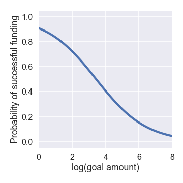
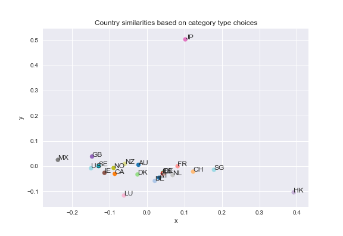

# Kickstarter data - inferential statistics

The Kickstarter dataset can provide useful statistical information about the relations between different features 
and for making predictions about the eventual success of the proposal.
We start by analyzing the data to select a subset suitable for developing a predictive model, then we investigate correlations and dependence between predictor variables,
and finally we test significance of predictor variables for predictions to select appropriate set of variables for building a predictive model. These results should provide us with a
guidlines for building a predictive model both for investors and proposers.

## Predictor and target variables

The primary target variables useful for both groups (investors and proposers), are (i) the binary catergorical variable **state**
representing the success or failure of the funding campaign, and (ii) the (roughly) continuum numerical variable **pledged** representing
the amount of money ultimately pledged by the investors. The predictor variables, whose significance and correlations will be tested, include (i) the **goal** amounts,
(ii) project **category type**, and (iii) **country** of project origin. A special variable is **staff pick**, which can be useful for investors,
but is not available as a predictor for proposers; therefore, we can treated as both target variable for propers and predictor variable for investors.

## Data variation over time

It can be observed that the success rate, calculated as a fraction of successful projects in a month, changes over time, possibly with changes in rules.

Splitting the data on 2014-07-01 and assigning them to two corresponding groups 'old' and 'new' shows two approximately normal distributions (checked with a Q-Q plot)
of montly success rates, with old success rate of 0.63 changing to 0.40 in the new period. A two-sample t-test was used to reject decisevely (p-value ~0) the null hypothesis
that this change of montly success rates is only a random fluctuation. 
The success rate trend closely corresponds to the overall monthly number of new projects, which significantly increased in mid 2014, but has been drifting down since then.

With respect to predictive modeling, we may also ask how the rules change influences the model parameters and its predictions. We should be able to train the model on both
the old data and new data, and investigate how transferable different model paramters are and whether the relations between the variables will still hold.
For instance, can the decrease in the success rate be explained simply as higher availability to lower quality projects, or did the new rules influence the model itself.

The data for the latest month are incomplete, and therefore exhibit a drop.

## Significance of individual predictor variables for estimating the success rates

## Category type and country
Using scipy.stats.chi2\_contingency function on the results of pivot table
with project success as index and category type in columns, we can test if there are statistically significant differences in success between all 15 different categories.
The result with large $\Chi^2 = 18747 $ and p-value ~ 0 confirms what was obvious from the visual exploratory analysis, i.e. there are in fact big differences
between success in different categories.

We repeated the same analysis for all 22 countries and also found very significant effect with $\Chi^2 = 2934$ and negligible p-value ~ 0.

### Staff picks
Staff picked project may highlight a potentially successful project to prospective investors.
Even though the picks are not simply guesses of the staff about the success of
individual projects, but may reflect their subjective opinions about the value of the project goals, we will treat treat the picks as predictions.
In this case we may calculate the confusion matrix to evaluate the usual prediction characteristics and their significance.

|          | Succeeded | Failed |
|----------|:---------:|:------:|
| Picked   | 23508     |  3764  |
|Not picked| 88306     | 107857 |

The calculated prediction characteristics (Accuracy = 0.59, Precision = 0.86, Recall = 0.21, Specificity = 0.97) show that the staff
is highly successful at eliminating unsuccessful projects (specificity) and most of their picks are successful (precision) despite the odds of randomly picking a succesful project.
Since only about 10% of projects are picked and around 40% is the success rate, it cannot be expected that the recall rate will be high.

We have also noticed that staff pick rates have been drifting down over the past 8 years from roughly 17.5% to about 7.5%.

### Effect of goal amount on success rate

The effect of the goal amount on the success of the funding campaign can be
evalueated using logistic regression and analyzing the significance of the
regression parameters (Figure 2). Here we used the statsmodels generalized regression
functionality for binomial family. The summary statistics shows near zero
p-values for both parameters - intercept -2.3 and slope 0.67, with the
funding probability as shown in the following figure.

## Correlations between predictor variables: category type vs. country

We noted in the exploratory data analysis, that there appears to be preference of different sets of categories based on the country of project origin.
Here we analyze if there are significant differences between countries when it comes to success within each category. Calculating $\Chi^2$ statistic (large)
and corresponding p-values (near zero) for success within each category based on the country of origin, leads to the conclusion that **country** variable has
significant effect on success asside from the category itself. Cultural
diffrences may explain this. For instance, while *dance* category type is overall successful, especially for less developed countries, such as Mexico,
none of the 4 projects originating from Switzerland succeeded, even though other projects from this country are succesful.
This may also suggest that artistic projects of this type are predominantly funded by investors from the same country,
assuming that investors from more conservative and developed countriescountries are less interested in this type of projects.
The question how important it is to add the country of origin information to the other variables will be answered more comprehensively by testing the
predictive model.

Inspired by these results, we can also look at similarity between countries
based on the types of projects. We compare similarity and distances between
countries based on the probability distributions over the category types proposers choose.
We can represent each distribution as a point in the probability space and
measure distances between countries. Using
dimensionality reduction based on PCA, we can also visualize the similarty
between different countries, as shown in the following figure.

It is seen that countries with similar cultures
and geographies can be found nearby. Thus, Mexico is on the opposite side of
the plot as Hong Kong and Singapore, US and Great Britain are very close, Scandinavian
countries are nearby, and so are other European countries. Interestingly,
Japan is most dissimilar from other countries.

Other correlations, such as goal and category can be analyzed, but we leave it
for the eventual analysis of the predictive model.

