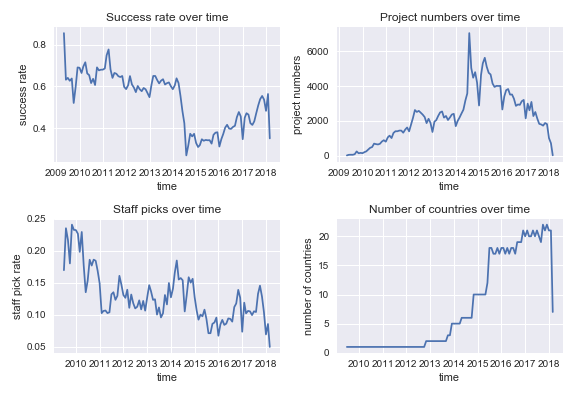
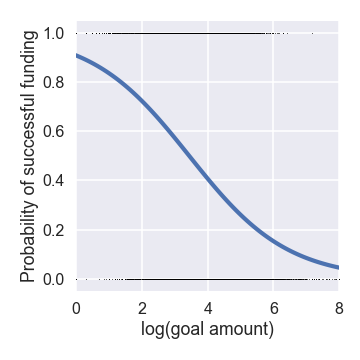
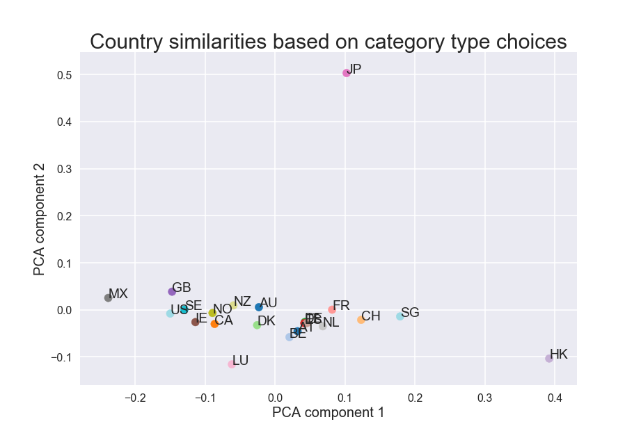

# Success Indicators of Crowdfunding Projects - milestone report
### (final paper draft)

### _Lukas Vlcek_

---

## 1. Introduction

Online crowdfunding platforms have become popular places for individuals and small teams to raise money for their projects by aggregating funds from many small investors. One of the earliest and most dominant platforms is Kickstarter, which as attracted more than 200,000 project proposals, out of which more than 100,000 have been successfully funded. It offers 15 main categories with a large number of subcategories, which are mainly focused on arts and manufacturing novel gadgets. The projects are only funded if the full amount is raised (all or nothing system), and the recent overall success rate is around 36%. The main goal of the project proposers is therefore to gather enough funding sufficient for completing their project by choosing the right category, funding target, and appropriate project description and promotion.

To decide whether it is worth starting a funding campaign or investing money in manufacturing of a new product, it is important to evaluate the expected success or failure of the project and to optimize the chances of success by choosing appropriate project category, funding target, and description. The goal of this data science project is to provide a tool for a client to make informed decisions about how (and whether) to proceed with their funding campaign.

This will accomplished by analysing historical data from the Kickstarter database of past and current projects to find indicators of success. With a predictive model, a client could weight the cost of their initial investments, and adjust the variables under their control to optimize the proposal to increase the chances of funding through adjustments to target amounts, the use of certain keywords, or the effect of more thorough and professional presentation. In addition, a predictive model of proposal success may serve as a filter for investors making decisions about funding. Also, individuals looking for new ideas could use the results to identify promising areas and avoid those with lower chance of success.

In the following I will analyze trends and correlations in the data to identify predictive features and construct a predictive model of succesful funding. Understandably, the model cannot be exptected to be completely accurate, because evaluation of the intrinsic value of a unique novel product often requires a substantial domain knowledge, which may be impossible to glean only from quantitative characteristics of the past records. However understanding the general drivers of proposal success may put the expectation of potential startups in perspective and avoid unnecessary costs.

## 2. Dataset

### 2.1 Source and format
The primary source of data for the Kickstarter platform has been obtained from online, monthly updated repositories collected by a web scraping company [Web Robots](https://webrobots.io/).

* [Kickstarter data (4/2014 - present): https://webrobots.io/kickstarter-datasets/](https://webrobots.io/kickstarter-datasets/). 

The data sets are available in JSON and CSV formats. For the present analysis, I chose CSV files, which are grouped into montly archives, with each archive containing around 30 individual files.

### 2.2 Contents of raw data

The total number of records in the combined CSV files was nearly 4 million, however most of these records were duplicates of the same projects recorded each month. Inspection of the individual CSV files indicated that monthly records starting from March 2016 to present adhere to the same features. These were selected for further analysis, while the older were discarded. Given the vast majority of the data adhered to the newer format and with reported >200K unique projects/samples the retained records should contain enough data for statistical analysis and modeling. This selection also eliminated missing values in the dataset.
Each of the selected records is characterized by 32 features, including dates, deadlines, project descriptions, funding goals, and invested funds.

### 2.3 Limitations

There are potentially additional sources of valuable data available on the internet, in the form of favorable articles, independent reviews, or responses under related video presentation (e.g., YouTube). Including this information would be valuable for increasing the accuracy of the predictive model, however, this would be beyond the scope of the currently proposed work.

## 3. Data wrangling

** Inspection of the contents and selection of relevant features **

Inspection of the columns indicate that many entries are in the form of JSON strings, with useful information embedded inside the directory structure. Some columns do not seem to contain information useful for this project (e.g. photo).
Dates seem to be stored in the form of a datastamp. Only informative relevant columns were selected, reducing their overall number from 32 to 18.

** Concatenating data frames from multiple CSV files and elimination of duplicate entries **

All 961 CSV files were read from the raw data directory tree and stored in a new concatenated dataframe.
The resulting dataset shows significant duplication of records as the same projects are recorded month after month. In fact around 90% of the entries are duplicates. While I have dropped identical records, there are still duplicate projects with the same id. As I am interested in comparing different projects and their final status, I eliminated all the ID duplicates and only keep the last one. Roughly 260K unique project records remained in the dataset, which corresponds to the number reported by Kicstarter.

** Filtering and cleaning data into a useful format **

As inspection of the entries showed, several were in the JSON string format. I have extracted the imporant 'category' feature from the appropriate JSON string in the 'category' column using 'map' method and JSON module. The resulting dataframe was saved in the interim data directory. Since the 'category' feature is rather fine grained with 169 different labels, I have processed this column to extract the more general category type descriptor which was contained as the first part of the category string (before '/'). The new cat_type colomn with 15 unique labels was added for exploratory analysis. The check for erroneous outliers did not reveal any suspicious items, only very skewed distributions. The resulting dataframe was saved in data/processed directory. The original 43 GB of raw data was reduced to a ~90 MB CSV file.

## 4. Statistical analysis 

## 4.1 Predictor and target variables

The primary target variables useful for both groups (investors and proposers), are (i) the binary catergorical variable **state** representing the success or failure of the funding campaign, and (ii) the (roughly) continuum numerical variable **pledged** representing the amount of money ultimately pledged by the investors. The predictor variables, whose significance and correlations will be tested, include (i) the **goal** amounts,
(ii) project **category type**, and (iii) **country** of project origin. A special variable is **staff pick**, which can be useful for investors, but is not available as a predictor for proposers; therefore, we can treated as both target variable for propers and predictor variable for investors.

## 4.2 Data variation over time

It can be observed that the success rate, calculated as a fraction of successful projects in a month, changes over time, possibly with changes in rules.

Splitting the data on 2014-07-01 and assigning them to two corresponding groups 'old' and 'new' shows two approximately normal distributions (checked with a Q-Q plot)
of montly success rates, with old success rate of 0.63 changing to 0.40 in the new period. A two-sample t-test was used to reject decisevely (p-value ~0) the null hypothesis
that this change of montly success rates is only a random fluctuation. 
The success rate trend closely corresponds to the overall monthly number of new projects, which significantly increased in mid 2014, but has been drifting down since then.

With respect to predictive modeling, we may also ask how the rules change influences the model parameters and its predictions. We should be able to train the model on both
the old data and new data, and investigate how transferable different model paramters are and whether the relations between the variables will still hold.
For instance, can the decrease in the success rate be explained simply as higher availability to lower quality projects, or did the new rules influence the model itself.

The data for the latest month are incomplete, and therefore exhibit a drop.

## 4.3 Significance of individual predictor variables for estimating the success rates

** Category type and country **

Using scipy.stats.chi2\_contingency function on the results of pivot table with project success as index and category type in columns, we can test if there are statistically significant differences in success between all 15 different categories. The result with large $\chi^2$ = 18747 and p-value ~0 confirms what was obvious from the visual exploratory analysis, i.e. there are in fact big differences between success in different categories.

The same analysis for all 22 countries and also yielded a very significant effect with $\chi^2$ = 2934 and negligible p-value ~0.

** Staff picks **

Staff picked project may highlight a potentially successful project to prospective investors.
Even though the picks are not simply guesses of the staff about the success of
individual projects, but may reflect their subjective opinions about the value of the project goals, we will treat treat the picks as predictions.
In this case we may calculate the confusion matrix to evaluate the usual prediction characteristics and their significance.

|          | Succeeded | Failed |
|----------|:---------:|:------:|
| Picked   | 23508     |  3764  |
|Not picked| 88306     | 107857 |

The calculated prediction characteristics (Accuracy = 0.59, Precision = 0.86, Recall = 0.21, Specificity = 0.97) show that the staff
is highly successful at eliminating unsuccessful projects (specificity) and most of their picks are successful (precision) despite the odds of randomly picking a succesful project.
Since only about 10\% of projects are picked and around 40\% is the success rate, it cannot be expected that the recall rate will be high.

We have also noticed that staff pick rates have been drifting down over the past 8 years from roughly 17.5\% to about 7.5\%.

** The effect of goal amount **

The effect of the goal amount on the success of the funding campaign can be evaluated using logistic regression and analyzing the significance of the regression parameters (Figure 2). Here we used the statsmodels generalized regression functionality for binomial family. The summary statistics shows near zero p-values for both parameters - intercept -2.3 and slope 0.67, with the funding probability as shown in the following figure.

## 4.4 Correlations between predictor variables: category type vs. country

We noted in the exploratory data analysis, that there appears to be preference of different sets of categories based on the country of project origin. Here we analyze if there are significant differences between countries when it comes to success within each category. Calculating $\chi^2$ statistic (large) and corresponding p-values (near zero) for success within each category based on the country of origin, leads to the conclusion that **country** variable has
significant effect on success asside from the category itself. Cultural diffrences may explain this. For instance, while *dance* category type is overall successful, especially for less developed countries, such as Mexico,
none of the 4 projects originating from Switzerland succeeded, even though other projects from this country are succesful. This may also suggest that artistic projects of this type are predominantly funded by investors from the same country, assuming that investors from more conservative and developed countriescountries are less interested in this type of projects. The question how important it is to add the country of origin information to the other variables will be answered more comprehensively by testing the predictive model.

Inspired by these results, we can also look at similarity between countries based on the types of projects. We compare similarity and distances between countries based on the probability distributions over the category types proposers choose. We can represent each distribution as a point in the probability space and measure distances between countries. Using dimensionality reduction based on PCA, we can also visualize the similarty between different countries, as shown in the following figure.

It is seen that countries with similar cultures and geographies can be found nearby. Thus, Mexico is on the opposite side of the plot as Hong Kong and Singapore, US and Great Britain are very close, Scandinavian countries are nearby, and so are other European countries. Interestingly, Japan is most dissimilar from other countries.

Other correlations, such as goal and category can be analyzed, but we leave it for the eventual analysis of the predictive model.

## 5. Predictive modeling

Since the available data contain information about the target variables, i.e., amounts raised and the success of funding campaigns, I will employ supervised learning algorithms to train the predictive models, using the scikit-learn library .

A simple way to explain a binary variable depending on numerical and categorical variables, such as the goal amount, and catogory, is to use logistic regression with dummy variables. This method will be tried first, and combined with a simple text analysis based on Naive Bayes method.

A more complex approach based on Bayesian inference will also be tested. It can be expected that explicit inclusion of correlations between predictor variables (as opposed to implicit through the regularization term in the logistic regression) will result in more accurate predictions. Also, by reconstructing the full joint distribution of data and model parameters will allow us to use the same model to generate artificial data, and provide predictions both for proposers and investors.
