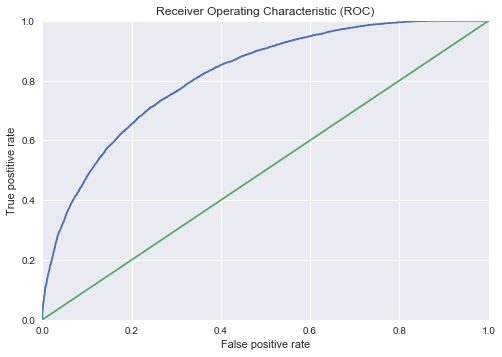

# Simple predictions of successful funding - logistic regression

### _Lukas Vlcek_

## 1. Introduction

Logistic regression is used to classify expected success or failure of Kickstarter projects.
The features include project category, country of origin, goal amount, project name, and its description.

## 2. Data setup

Notebook configuration


```python
%matplotlib inline
import os
import numpy as np
import pandas as pd
import matplotlib.pyplot as plt
import seaborn as sns
import datetime
```

Create a dataframe from a pre-processed CSV file and filter out uninformative features


```python
target_path = '../data/processed'
report_path = '../reports'
filename = 'kick_id.csv'
datecols = ['created_at', 'deadline', 'state_changed_at', 'launched_at']
fdatpars = lambda x: datetime.datetime.fromtimestamp(int(x)).strftime('%Y-%m-%d %H:%M:%S')
df = pd.read_csv(os.path.join(target_path, filename), index_col='id', parse_dates=datecols, date_parser=fdatpars)
```

Filter out unneeded data and add some indicator features


```python
df = df.drop(['disable_communication'], axis='columns')
df = df.loc[(df['state'] != 'live') & (df['state'] != 'suspended')]
cat_type = [x.split('/')[0] for x in df['category'].values]
df['cat_type'] = np.array(cat_type)
#df['dummy'] = 1
df['period'] = (df['launched_at'] >= '2014-06-01') & (df['launched_at'] < '2018-01-01')
df['succeeded'] = np.int_(df['state'] == 'successful')
df['staff_pick'] = np.int_(df['staff_pick'])
#df.sort_values('launched_at').loc[df.period]['launched_at'].shape
```


```python
# counting words in project names and blurbs
df.loc[df['blurb'].isnull(), 'blurb'] = ''
df.loc[df['name'].isnull(), 'name'] = ''
df['blurb_wlen'] = df['blurb'].str.split().apply(len)
df['name_wlen'] = df['name'].str.split().apply(len)
```


```python
# make new dataframes with new and old data
dfn = df.loc[df.period].copy()
dfo = df.loc[~df.period].copy()
dfn.shape, dfo.shape
```


    ((149007, 22), (89449, 22))


```python
# take logarithm of goals
dfn['goal_log'] = np.log10(dfn['goal'].values)
```


```python
# drop unwanted columns
dfm = dfn.drop(['usd_pledged','goal','state','slug','currency','deadline','state_changed_at','created_at','backers_count','spotlight','period'], axis=1).copy()
# get dummies
dfd = pd.get_dummies(dfm, columns=['country','cat_type'])
```


```python
dfm.head()
```


<div>
<style>
    .dataframe thead tr:only-child th {
        text-align: right;
    }

    .dataframe thead th {
        text-align: left;
    }

    .dataframe tbody tr th {
        vertical-align: top;
    }
</style>
<table border="1" class="dataframe">
  <thead>
    <tr style="text-align: right;">
      <th></th>
      <th>name</th>
      <th>pledged</th>
      <th>country</th>
      <th>launched_at</th>
      <th>staff_pick</th>
      <th>blurb</th>
      <th>category</th>
      <th>cat_type</th>
      <th>succeeded</th>
      <th>blurb_wlen</th>
      <th>name_wlen</th>
      <th>goal_log</th>
    </tr>
    <tr>
      <th>id</th>
      <th></th>
      <th></th>
      <th></th>
      <th></th>
      <th></th>
      <th></th>
      <th></th>
      <th></th>
      <th></th>
      <th></th>
      <th></th>
      <th></th>
    </tr>
  </thead>
  <tbody>
    <tr>
      <th>18520</th>
      <td>Grandma's are Life</td>
      <td>62.0</td>
      <td>US</td>
      <td>2016-10-19 09:32:40</td>
      <td>0</td>
      <td>Raising money to help my grandmother recover f...</td>
      <td>music/world music</td>
      <td>music</td>
      <td>0</td>
      <td>24</td>
      <td>3</td>
      <td>4.176091</td>
    </tr>
    <tr>
      <th>21109</th>
      <td>Meta</td>
      <td>173.0</td>
      <td>GB</td>
      <td>2015-04-07 18:37:44</td>
      <td>0</td>
      <td>My work is performance based but I branch out ...</td>
      <td>art/performance art</td>
      <td>art</td>
      <td>1</td>
      <td>24</td>
      <td>1</td>
      <td>2.176091</td>
    </tr>
    <tr>
      <th>24380</th>
      <td>Puss N' Books: A relaxing cat cafe and bookstore.</td>
      <td>776.0</td>
      <td>US</td>
      <td>2015-10-27 11:25:33</td>
      <td>0</td>
      <td>A sanctuary for humans and felines alike! Come...</td>
      <td>food/spaces</td>
      <td>food</td>
      <td>0</td>
      <td>24</td>
      <td>9</td>
      <td>4.301030</td>
    </tr>
    <tr>
      <th>33867</th>
      <td>TASTE MAKERS BY TRISH P</td>
      <td>2798.0</td>
      <td>CA</td>
      <td>2015-06-15 14:28:11</td>
      <td>1</td>
      <td>Taste Makers is a socially conscious brand tha...</td>
      <td>fashion/ready-to-wear</td>
      <td>fashion</td>
      <td>0</td>
      <td>23</td>
      <td>5</td>
      <td>4.255273</td>
    </tr>
    <tr>
      <th>39036</th>
      <td>The Meat Candy Experience</td>
      <td>3239.0</td>
      <td>US</td>
      <td>2016-05-16 18:34:18</td>
      <td>0</td>
      <td>The BEST beef sticks, beef jerky and signature...</td>
      <td>food/small batch</td>
      <td>food</td>
      <td>1</td>
      <td>13</td>
      <td>4</td>
      <td>3.397940</td>
    </tr>
  </tbody>
</table>
</div>


## 3. Modeling


```python
# ML imports
from sklearn.feature_extraction.text import CountVectorizer, TfidfVectorizer
from sklearn.model_selection import train_test_split, GridSearchCV, cross_val_score, cross_val_predict
from sklearn.feature_selection import SelectKBest, chi2
from sklearn.linear_model import LogisticRegression, LogisticRegressionCV
from sklearn.metrics import roc_curve, roc_auc_score, classification_report
from sklearn.base import TransformerMixin, BaseEstimator, clone
from sklearn.pipeline import Pipeline, FeatureUnion
```

Select predictor and target columns for model fitting


```python
predictors_nt = []
predictors_nt.extend([c for c in dfd.columns if c[0:5] == 'cat_t' ])
predictors_nt.extend([c for c in dfd.columns if c[0:5] == 'count' ])

predictors_nt.extend(['goal_log', 'name_wlen'])
#predictors.extend(['goal_log','name_wlen', 'staff_pick'])

predictors_text = []
predictors_text.extend(['name', 'blurb'])

predictors = predictors_nt + predictors_text

target = ['succeeded']
#target = ['staff_pick']
```

Train-test split for pandas dataframe


```python
df_train=dfd.sample(frac=0.8,random_state=200)
df_test=dfd.drop(df_train.index)
```


```python
# Training dataset
Xtrain = df_train[predictors]
ytrain = df_train[target].values.astype(np.int).flatten() 

# Testing dataset
Xtest = df_test[predictors]
ytest = df_test[target].values.astype(np.int).flatten() 
```

### 3.1 Create a pipeline

1. Textual features (name, blurb) will be separated for their individual treatment
2. Textual features will be individually vectorized
3. $\chi^2$ feature selection will be performed on the vectorized features.
4. The selected textual features will be combined with other features
5. Logistic regression will be applied. (LASSO regularization will further reduce the number of relevant features).


#### 3.1.1 Define classes needed to separate and join selected features from pandas dataframes


```python
# Define a selector class to be used in the main pipeline
class ColumnSelector(BaseEstimator, TransformerMixin):
    """Select a column from pandas dataframe.
    Transfrom returns pandas Series """
    
    def __init__(self, column=''):
        self.column = column

    def fit(self, dataframe, y=None):
        return self

    def transform(self, dataframe):
        return dataframe[self.column]
```


```python
class FeaturesSelector(BaseEstimator, TransformerMixin):
    """Select columns from pandas dataframe.
    Transform returns numpy array with one or more features"""
    
    def __init__(self, columns=[]):
        self.columns = columns

    def fit(self, dataframe, y=None):
        return self

    def transform(self, dataframe):
        return dataframe[self.columns].values
```

#### 3.1.2 Define pipeline structure


```python
# Define the main pipeline (contains sub-pipelenes for text processing and feature selection)
pipeline = Pipeline([
    ('union', FeatureUnion(
        transformer_list=[
            ('name', Pipeline([
                ('selector', ColumnSelector('name')),
                ('vectorizer', CountVectorizer()),
                ('reduce_dim', SelectKBest(chi2, k=100))
            ])),
            ('blurb', Pipeline([
                ('selector', ColumnSelector('blurb')),
                ('vectorizer', CountVectorizer()),
                ('reduce_dim', SelectKBest(chi2, k=1000))
            ])),
            ('rest', Pipeline([
                ('selector', FeaturesSelector(predictors_nt)),
            ]))
        ])),
    ('logreg', LogisticRegression(penalty='l2', C=0.1))
])
```

### 3.2 Fit pipeline and print parameter information


```python
pipeline.fit(Xtrain, ytrain)
```


    Pipeline(steps=[('union', FeatureUnion(n_jobs=1,
           transformer_list=[('name', Pipeline(steps=[('selector', ColumnSelector(column='name')), ('vectorizer', CountVectorizer(analyzer='word', binary=False, decode_error='strict',
            dtype=<class 'numpy.int64'>, encoding='utf-8', input='content',
            ...ty='l2', random_state=None, solver='liblinear', tol=0.0001,
              verbose=0, warm_start=False))])


```python
logreg = pipeline.named_steps['logreg']
print('Number of features:', len(logreg.coef_[0]))
print('Number of non-zero features:', np.sum(logreg.coef_ != 0.0))
print('Maximal regression coefficient:', logreg.coef_.max())

indices = np.nonzero(pipeline.named_steps['union'].transformer_list[0][1].named_steps['reduce_dim'].get_support())
voca = pipeline.named_steps['union'].transformer_list[0][1].named_steps['vectorizer'].vocabulary_
print('\nWords from project names selected by chi2 feature selection as most informative of success/failure.\n')
print([key for key, value in voca.items() if value in indices[0]])
```

    Number of features: 1139
    Number of non-zero features: 1139
    Maximal regression coefficient: 1.50586055239
    
    Words from project names selected by chi2 feature selection as most informative of success/failure.
    
    ['terrain', 'the', 'by', 'album', 'playing', 'cards', 'presents', 'board', 'game', 'mobile', 'comic', 'book', 'vol', 'canceled', 'app', 'new', 'of', 'film', 'short', 'com', 'dance', 'enamel', 'pins', 'restaurant', 'business', 'my', 'most', 'burning', '2014', 'novel', 'debut', 'ep', 'watch', 'youtube', 'brand', 'steampunk', 'about', 'minimalist', '2016', 'record', 'roleplaying', 'social', 'apparel', 'volume', 'watches', 'food', 'miniatures', 'bike', 'bag', 'edinburgh', 'edition', 'tarot', 'full', 'length', 'fantasy', 'rpg', 'issue', 'pin', '2017', 'network', 'fashion', 'tabletop', 'coloring', 'dice', 'clothing', 'sci', 'fi', 'season', 'nudes', 'documentary', 'dungeon', 'wallet', 'truck', 'set', 'pens', 'backpack', 'card', '5e', 'online', 'website', 'titanium', 'anthology', 'media', 'vinyl', 'pen', 'carbon', 'sports', 'miniature', 'thesis', 'plush', 'fringe', 'zine', '28mm', 'residency', 'news', 'cthulhu', 'bbq', 'carry', 'edc', 'pathfinder']


The most important words are highly indicative of the category, so conditioning on category (have predictors for each category), may select a smaller number of words adding truly new information.

### 3.3 Predict labels and probabilities


```python
y_pred = pipeline.predict(Xtest)
y_pred_prob = pipeline.predict_proba(Xtest)
```

### 3.4 Prediction statistics


```python
print('Accuracy on the training data:', pipeline.score(Xtrain, ytrain))
print('Accuracy on the testing data:', pipeline.score(Xtest, ytest))
```

    Accuracy on the training data: 0.754181836485
    Accuracy on the testing data: 0.746485017281


```python
fpr, tpr, thresholds = roc_curve(ytest, y_pred_prob[:,1])
plt.plot(fpr, tpr)
plt.plot([0,1],[0,1])
plt.axis([0,1,0,1])
plt.xlabel('False positive rate')
plt.ylabel('True postitive rate')
plt.title("Receiver Operating Characteristic (ROC)")
print('AUC', roc_auc_score(ytest, y_pred_prob[:,1]))
```

    AUC 0.817426000062





```python
print(classification_report(ytest, y_pred))
```

                 precision    recall  f1-score   support
    
              0       0.77      0.85      0.80     18386
              1       0.70      0.59      0.64     11415
    
    avg / total       0.74      0.75      0.74     29801
    


### Predicting staff picks

Staff picks can be considered as optimizing precision. The data shows precision of 0.86, with recall of 0.21.

Setting the threshold to 10% selected projects, we can predict precision and recall of staff picks from our model.


```python
# Find threshold for 10% selection rate
#thresh = np.linspace(0.0, 1.0, 101)
#for t in thresh:
#    print(t, np.sum(y_pred_prob[:,1] > t)/y_pred_prob.shape[0])

y_predx = np.int_(y_pred_prob[:,1] > 0.77)
print('Fraction of picked projects at threshold 0.77:', np.sum(y_predx)/y_predx.shape[0])
```

    Fraction of picked projects at threshold 0.77: 0.0962719371833


```python
print(classification_report(ytest, y_predx))
```

                 precision    recall  f1-score   support
    
              0       0.67      0.98      0.79     18386
              1       0.85      0.21      0.34     11415
    
    avg / total       0.74      0.68      0.62     29801
    


Our model picks based match almost exactly the precision (0.86) and recall (0.22) of real staff picks, which are not available to proposers.


```python

```
